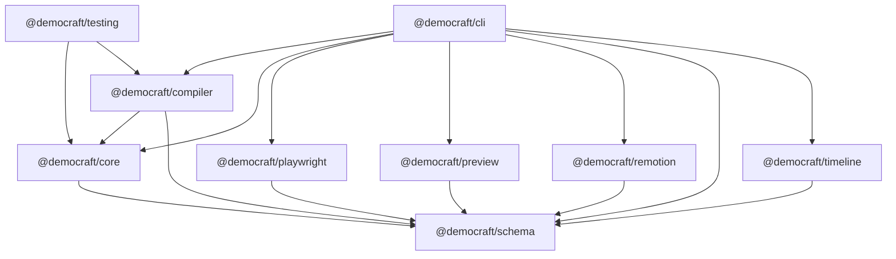

# Architecture

This document describes how the Democraft monorepo is wired together **today**, package by package. For the original design intent, see `../spec/13-system-architecture.md`. This doc only reflects what is actually checked in under `packages/`.

## Layout

```text
packages/
  schema/      JSON-serializable types + Zod schemas + diagnostic codes
  core/        Authoring API: defineDemo, defineTargets, locator builders
  compiler/    Captures authored demos and normalizes them to DemoIR
  playwright/  Runs DemoIR in a real browser, produces RecordedDemoManifest
  timeline/    Folds IR + manifest into a RenderTimeline (frame-accurate)
  preview/     Standalone HTML preview from manifest + timeline
  remotion/    React component tree that renders an MP4 from a timeline
  cli/         Single entry point: inspect, targets, validate, capture, timeline, preview, render
  testing/     Reusable demo factory for examples and golden tests
```

There are no `apps/`, `presets/`, or top-level `remocn/` packages — `../spec/13-system-architecture.md` describes those as planned. The only `remocn/` directory that exists lives inside `packages/remotion/src/components/remocn/` and currently holds a single component (`soft-blur-in.tsx`).

Most packages were recently split out from single-file `src/index.ts` modules into focused files. The barrel `src/index.ts` in each package still re-exports everything, so consumers can keep importing from the package root.

## Workspace dependency graph



`schema` is the leaf every other package depends on. `core` depends only on `schema`. `compiler` depends on `core` + `schema`. Everything that "does work" (playwright, timeline, preview, remotion) depends only on `schema`. The CLI is the only package that depends on every other workspace package; the testing package depends only on `core` + `compiler`. Notice that `remotion` does **not** depend on `compiler` or `playwright` — it only consumes the manifest + timeline JSON shapes, which keeps the renderer cacheable and decoupled.

## Package-by-package

### `@democraft/schema`

Purpose: defines every JSON-serializable shape that crosses a package boundary. No runtime code besides Zod schemas.

Public API surface — split across focused files, all re-exported from `packages/schema/src/index.ts`:

- `version.ts` — `schemaVersion = "1" as const` (line 1). Every persisted JSON carries this.
- `diagnostics.ts` — the `DCxxxx` diagnostic code table, docs URL helper, and the `Diagnostic` shape with optional demo/scene/step/target context.
- `geometry.ts` — `BoundingBox` (line 1), `Locator` discriminated union (line 8: `role`/`label`/`testId`/`text`), `TargetDefinition` (line 14).
- `steps.ts` — the 14 step types and the `DemoStep` union (lines 84-98, keyed on `kind`).
- `scenes.ts` — `SceneMetadata`, `DemoSceneIR` (line 19), `DemoIR` (line 27).
- `recorded.ts` — `TargetSnapshot` (line 12), `RecordedStep` (line 21), `RecordedDemoManifest` (line 31).
- `timeline.ts` — `RenderStep` (line 6), `RenderScene` (line 15), `CameraTrack` (line 22), `CursorTrack` (line 33), the two-arm `OverlayTrack` union (line 47), `RenderTimeline` (line 72).
- `schemas.ts` — Zod schemas: `locatorSchema` (line 5), `targetDefinitionSchema` (line 16), `diagnosticSchema` (line 28). Note: only the input-side schemas are exported as values today; runtime validation of `DemoIR`/`RenderTimeline` is structural, not Zod-driven.

Dependencies: only `zod`. No workspace deps.

### `@democraft/core`

Purpose: the one authoring API. Pure type-level + thin runtime helpers — no I/O, no parsing.

Public API surface — barrel at `packages/core/src/index.ts` re-exports from:

- `define.ts` — `defineDemo(definition)` (line 7) and `defineConfig(config)` (line 3). Identity helpers that exist for type inference at the call site.
- `targets.ts` — `defineTarget(target)` (line 4) and `defineTargets(record)` (line 8). The latter accepts either raw `Locator`s (wrapped into a single-locator target) or full `TargetDefinition`s and returns the normalized `TargetMap`.
- `locators.ts` — `byRole` (line 3), `byLabel` (line 7), `byTestId` (line 11), `byText` (line 15).
- `types.ts` — the authoring-facing types: `CapturedStep` union (lines 41-67), `DemoScene` interface (lines 69-96, the methods the author's `run` callback receives), `DemoCapture` (line 98), `DemoDefinition` (line 110), plus option types `CaptionOptions`/`CalloutOptions`/`FocusOptions`/`TransitionOptions`.

Dependencies: `@democraft/schema`.

### `@democraft/compiler`

Purpose: takes a `DemoDefinition` and produces a serializable `DemoIR` plus a list of static `Diagnostic`s.

Public API surface — barrel at `packages/compiler/src/index.ts` re-exports from:

- `compile.ts` — `compileDemo(definition): Promise<CompilationResult>` (line 8). Runs the author's `run({ demo })` callback against a stub `demo` object (line 14) whose `scene()` records each step, then normalizes via `normalizeScene`, then runs `validateIR`.
- `validation.ts` — `validateIR(ir): Diagnostic[]`. Checks required fields (`DC001`), duplicate ids (`DC002`), targets (`DC101`, `DC106`), scenes/steps (`DC103`, `DC104`), and custom visuals (`DC107`, `DC108`).
- `inspect.ts` — `inspectIR(ir): string` (line 3). Pretty-printer used by `democraft inspect`; the per-kind `describeStep` switch is at line 17.
- `duration.ts` — `parseDurationMs(duration): number | null` (line 1). Accepts `250ms`, `1s`, `1.5s`.

Internal helpers: `capture.ts` exports `createSceneCapture` (line 3) which builds the `DemoScene` proxy that turns author calls into `CapturedStep` entries. `normalize.ts` exports `normalizeScene` (line 6) and the private `normalizeStep` (line 22) which slug-generate ids and apply defaults. `types.ts` defines the internal `CapturedScene` and the public `CompilationResult`.

Dependencies: `@democraft/core`, `@democraft/schema`.

### `@democraft/playwright`

Purpose: executes the compiled IR in a real Chromium instance, records per-step timing, screenshots, traces, and target bounding boxes, and writes `manifest.json` to disk.

Public API surface — barrel at `packages/playwright/src/index.ts` re-exports from:

- `runner.ts` — `runDemo(ir, options)` (line 14, the production entry) and `runDemoWithBindings(ir, bindings, options)` (line 21, the testable core). The production entry delegates to `runDemoWithBindings` with `defaultBindings`.
- `bindings.ts` — `defaultBindings: PlaywrightBindings = { chromium }` (line 4). The single place the real `playwright` import lives.
- `locator.ts` — `resolveTarget(ir, page, targetId, timeoutMs)` (line 4). Exported for unit tests; tries each declared `Locator` in order and records every attempt on the snapshot. Also exports `createLocator` (line 66) and `resolveUrl` (line 79).
- `types.ts` — `PlaywrightBindings` (line 55) and the structural types `BrowserLike`/`BrowserContextLike`/`PageLike`/`LocatorLike` (lines 18-53), the subset of the Playwright API the package consumes. Plus `RunDemoOptions` (line 11) and `RuntimeEnvironment` (line 1).

Internals: `execute.ts` exports `executeStep` — the switch over `DemoStep["kind"]`. Targeted browser, assertion, camera, and callout steps resolve the target and store the resulting `TargetSnapshot`. `captureStepHoldMs` decides how long Playwright waits after each step so the screenshot matches the planned timeline duration. `diagnostics.ts` emits contextual `DC201` runtime failures.

**Page Discovery** also lives in this package (the read-only counterpart to capture):

- `discover.ts` — `discoverPage(options)` (the production entry) and `discoverPageWithBindings`. Mirrors `runDemo`'s shape: validate origin → create artifact → start → launch browser → `goto` → collect → persist → complete.
- `discovery-origin.ts` — `assertDiscoveryAllowed(url, allowlist)` enforces the read-only origin allowlist; emits `DC401`/`DC402`.
- `discovery-snapshot.ts` — `collectPageDiscovery(page)` reads a compact accessibility-oriented inventory in a single `page.evaluate()` round-trip and turns it into a `PageDiscovery`. Filtering (drop decorative/invisible) and collection aggregation happen here.
- `discovery-scoring.ts` — pure, deterministic `scoreLocatorCandidates(input)`. Confidence is a pure function of (role, name, matchCount, visibility); same DOM → same score. No browser, no I/O — fully unit-tested.
- `discovery-artifacts.ts` — the run lifecycle (`created`/`running`/`completed`/`failed`/`cancelled`), atomic writes, `latest.json` pointer. Mirrors `capture-artifacts.ts` and reuses `writeFileAtomic` + `redactCaptureErrorMessage`. Persisted under `.democraft/discovery/<application-id>/runs/<run-id>/`.

Discovery reuses the authoring `Locator` vocabulary from `@democraft/schema`, so every `locatorCandidate.locator` converts directly into a `byRole`/`byLabel`/`byTestId`/`byText` call. See `docs/architecture/discovery.md`.

Dependencies: `@democraft/schema`, `playwright` (`^1.58.2`).

### `@democraft/timeline`

Purpose: folds the IR and the recorded manifest into a single frame-accurate `RenderTimeline` that the renderer consumes.

Public API surface — barrel at `packages/timeline/src/index.ts` re-exports from:

- `resolve.ts` — `resolveTimeline(ir, manifest, options): RenderTimeline` (line 13). Walks scenes in order, assigns each step `fromFrame` + `durationInFrames`, and appends tracks to `timeline.camera`/`timeline.cursor`/`timeline.overlays` via `collectTracks` (line 69). `stepDurationMs` (line 135) takes `max(plannedMs, actualMs)` so a slow page load extends the timeline but a fast click still respects the minimum animation window; `msToFrames` (line 182) always rounds up to at least one frame.
- `inspect.ts` — `inspectTimeline(timeline): string` (line 3). Pretty-printer for `democraft timeline`.
- `types.ts` — `ResolveTimelineOptions = { fps?: number }` (line 1).

Dependencies: `@democraft/schema`.

### `@democraft/preview`

Purpose: writes a self-contained HTML file that simulates the rendered video using the captured screenshots + the timeline, without invoking Remotion. Useful for fast iteration in a browser.

Public API surface — barrel at `packages/preview/src/index.ts` re-exports from:

- `template.ts` — `renderPreviewHtml(input): string` (line 4). Returns the full HTML document. Inlines the timeline, recording dimensions, and per-step screenshot URLs as JSON inside a `<script>` block. The embedded JS plays back frames on a `requestAnimationFrame` loop, overlays target boxes / cursor / captions / callouts scaled to the recording's resolution, and highlights the active step in the side panel.
- `types.ts` — `PreviewInput` (line 3): `{ manifest, timeline, videoSrc?, screenshotSrcByStepId? }`.
- `escape.ts` — internal HTML/JSON escapers used by the template.

Dependencies: `@democraft/schema`. No workspace deps beyond schema.

### `@democraft/remotion`

Purpose: the React composition that turns a `RenderTimeline` into an MP4. See `remotion-integration.md` for the deep dive.

Public API surface:

- `packages/remotion/src/index.ts` — exports `renderDemoVideo(options)` (line 21) and re-exports `ProductDemoVideo` and `compositionId`. `renderDemoVideo` bundles `entry.ts`, selects the composition via `selectComposition`, and calls `renderMedia` with `codec: "h264"`, `crf: 15` (configurable), `jpegQuality: 100`, and the user-supplied `scale`. The temp-`publicDir` setup that lets `staticFile` serve `recording.webm` is at line 56.
- `packages/remotion/src/entry.ts` — calls `registerRoot(Root)` (line 34) and registers a single `Composition` whose `id` is `compositionId = "MotionDemo"`, sized 1920x1080 @ 60fps, with `calculateMetadata` reading duration/fps/dimensions from input props.
- `packages/remotion/src/composition.ts` — the trimmed-down orchestration layer. It imports `Backdrop`/`StageMedia`/`stageLayout` from `./stage` (line 15), `TargetAndCursorLayer` from `./cursor` (line 6), and `OverlayLayer` + the visual components from `./overlays` (lines 7-14). `ProductDemoVideo` (line 67) is just the four-layer stack. The `visualRegistry` literal (line 56) is the only registry instance; it is passed into `OverlayLayer` as a prop.
- `packages/remotion/src/camera.ts` — `CameraState`, `makeCamera`, `identityCamera`, `cameraStateAt`, `cameraTarget`, `cameraTransform`.
- `packages/remotion/src/cursor.ts` — `TargetAndCursorLayer`, `ClickRipple`, `CLICK_PULSE_FRAMES = 28` (line 8).
- `packages/remotion/src/overlays.ts` — `OverlayLayer`, the `VisualRegistry` type (line 23), the built-in `Caption`/`KineticCaption`/`Callout`/`GlassCallout` components, plus `overlayOpacity` and `calloutStyle` helpers.
- `packages/remotion/src/stage.ts` — `stageLayout`, `transformedBox`, `stageMediaState`, `Backdrop`, `StageMedia`.
- `packages/remotion/src/utils.ts` — `active`, `lerp`, `smoothstep`.
- `packages/remotion/src/components/remocn/soft-blur-in.tsx` — the first Remocn-style cinematic component. See `remocn-integration.md`.

Dependencies: `@democraft/schema`, `@remotion/bundler`, `@remotion/renderer`, `react`, `react-dom`, `remotion`.

### `@democraft/testing`

Purpose: a factory for reusable demo fixtures. Imported by examples under `examples/` and by package-level tests.

Public API surface (`packages/testing/src/index.ts`):

- `createProjectTargets()` (line 9) — returns a `TargetMap` for a fictional dashboard demo.
- `createProjectDemo()` (line 21) — returns a complete `DemoDefinition` exercising scenes, captions, focus, callouts, and holds.

Dependencies: `@democraft/core`, `@democraft/compiler`.

### `@democraft/cli`

Purpose: the single binary `democraft` that wires the previous packages into seven commands. This is the only package that knows about all of them.

Public API surface — barrel at `packages/cli/src/index.ts` re-exports from:

- `run.ts` — `runCli(argv): Promise<CliResult>` (line 21). The entry point. Parses argv, dispatches to `inspect`/`targets`/`validate`/`capture`/`timeline`/`preview`/`render`.
- `args.ts` — `parseArgs(argv): ParsedArgs` (line 3). Pure argv parser, exported for tests.
- `format.ts` — `formatDiagnostics(...)` (line 4) pretty-prints diagnostics; `formatTargets` (line 16) and `formatTargetsJson` (line 27) power the `targets` command.
- `loaders.ts` — `loadDemo` (line 7), `resolveRecordingPath` (line 18), `buildScreenshotSources` (line 22, file URLs for the preview), `buildScreenshotDataUrls` (line 37, base64 data URLs for the renderer).
- `types.ts` — `CliResult` (line 1) and `ParsedArgs` (line 7).
- `help.ts` — `help()`, `ok(...)`, `fail(...)`.

The `capture` path calls `compileDemo` (`run.ts:134`) → checks diagnostics → `runDemo` (`run.ts:214`). The `timeline` path re-compiles, re-checks diagnostics, reads `manifest.json`, and calls `resolveTimeline` (`run.ts:185`). The `preview` (`run.ts:59`) and `render` (`run.ts:94`) paths skip compilation entirely and consume a manifest + timeline JSON pair, which is what makes them re-runnable without a browser.

Dependencies: every workspace package except `testing`.

## Caching boundaries

The data flow crosses exactly five on-disk artifacts, each independently cacheable:

1. `demo.ts` source (author edits)
2. `DemoIR` (output of `compileDemo` — currently in-memory only)
3. `.democraft/runs/<id>/manifest.json` + `screenshots/` + `trace.zip` (output of `runDemo`)
4. `.democraft/timelines/<id>.<orientation>.json` (output of `resolveTimeline`)
5. `.democraft/previews/<id>.html` and `.democraft/renders/<id>.mp4` (outputs of the preview/render commands)

Re-rendering after a copy or camera-direction change only needs to re-run step 4 onward. Re-capturing is only required when browser steps, targets, or the source app change.
